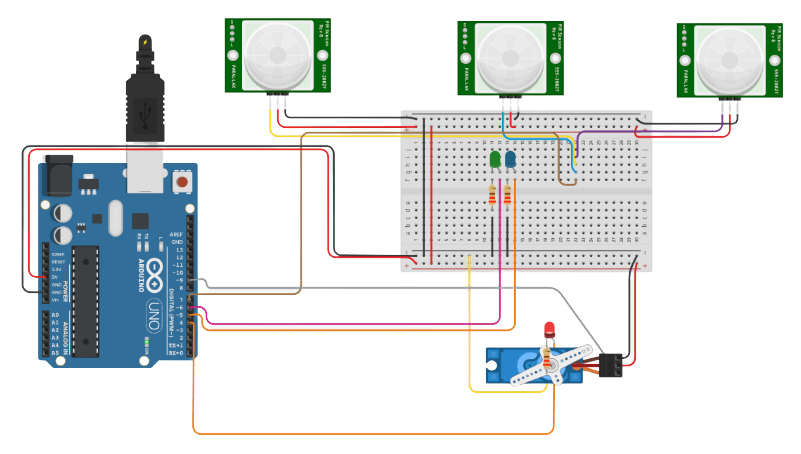

<!-- Repository Banner -->
<p align="center">
  
</p>

---

## 🔹 Overview

A microcontroller-based automation system that simulates the behaviour of a security light. The system detects motion using multiple PIR sensors and automatically rotates a servo-mounted light toward the direction of detected movement. Developed as part of an Embedded Systems module during the second year of undergraduate studies at SLIIT.
<p align="center">
  
</p>
 
>Full system description referenced from project documentation.

---

## 🔹 Project Overview

This prototype uses **three PIR motion sensors** to detect movement from three different directions.  
When motion is detected, the system:

1. Identifies which PIR sensor triggered  
2. Rotates a **servo motor** to face the detected zone  
3. Activates a mounted LED/light toward that direction  
4. Returns to idle state after a delay  

The system runs on an **Atmega328p microcontroller** and is programmed using **C**.

---

## 🔹 Features

- Multi-directional motion detection (3 PIR sensors)
- Automatic servo rotation based on detection zone
- Light-tracking capability similar to a real security light
- Real-time sensor reading and actuator control
- Efficient C implementation for AVR microcontroller
- Breadboard prototype built with modular, testable wiring

---

## 🔹 Technologies & Components

>### **Microcontroller**
- Atmega328p (AVR)

>### **Sensors & Outputs**
- PIR motion sensors × 3  
- Servo motor (directional light control)  
- Indicator LED(s)

>### **Software**
- C Programming Language  
- AVR-GCC / Atmel Studio / Arduino toolchain

>### **Hardware Tools**
- Breadboard  
- 5V USB power supply  
- Jumper wires  
- Cardboard PIR mounts (custom-built)

---

## 🔹 System Architecture
>### Block Diagram (Text Representation)
```bash
        [PIR Sensor - Left]  ----\
                                  \
        [PIR Sensor - Center] ----> [Atmega328p MCU] --> [Servo Motor] --> [Light]
                                  /
        [PIR Sensor - Right] ----/
```
>### Architecture Summary
<p align="center">
  
</p>


### 🔶 Simulation & Hardware Preview

>### 🔹 **Tinkercad Simulation**
Below is the breadboard implementation used for the project: <a href="https://www.tinkercad.com/things/cMI0WKOE0Zd-project01/editel">Go see the project on Tinkercad</a>




>### 🔹 **Real Hardware Prototype**


---

## 🔹 How It Works

- PIR sensors produce HIGH (1) when motion is detected  
- MCU reads inputs from all sensors  
- Based on the input:
  - Sensor 1 → Rotate servo to **left**  
  - Sensor 2 → Rotate servo to **center**  
  - Sensor 3 → Rotate servo to **right**  
- LED/light activates in the detected direction  
- After a timeout, servo returns to neutral position  

---

## 🔹 Learning Outcomes

- Practical experience with **embedded C programming**  
- Interfacing sensors with a microcontroller  
- Servo control using PWM signals  
- Real-time event-driven automation  
- Breadboard circuit implementation techniques  
- Understanding PIR sensor behavior and signal conditioning  

---

## 🔹 Future Improvements

- Add wireless alerting (GSM/Bluetooth/WiFi)
- Replace LED with high-power directional beam  
- Introduce machine learning for movement pattern analysis  
- Implement 360° rotation using stepper motors  
- Integrate cloud logging for IoT functionality  

---

## 🔹 License

This project is licensed under the **MIT License**.  
You are free to use, modify, and distribute this work, provided that proper credit is given.

---

## 🔹 Citation
```bash
Kasthuriarachchi, S.D. (2020) Motion Sensor Circuit to Detect Intruders. GitHub repository. Available at: https://github.com/sadeep654/Motion-Sensor-Circuit-to-Detect-Intruders (Accessed: date-you-accessed).
```

---

## 👤 Credit

```bash
Copyright (c) 2020 Sadeep Dilshan Kasthuriarachchi
```  
If you use or reference this project, please credit the original author.


